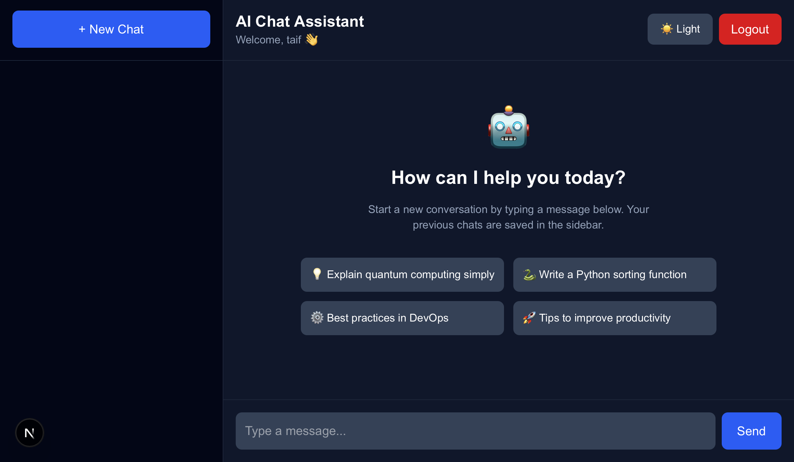

# AI Assistant Platform

A full-stack AI chat assistant built with:

- Frontend: Next.js + Tailwind CSS
- Backend: FastAPI + SQLAlchemy
- AI Model: Groq Llama 3.3 70B
- Authentication: JWT
- Database: SQLite

---

# AI Assistant Platform

> A full-stack AI chat application with JWT authentication, 
> multi-conversation management, and real-time AI responses 
> powered by Groq's Llama 3.3 70B model.

---

# Features

- User Authentication (Register/Login)
- JWT Protected Routes
- Multi Chat Conversations
- Sidebar Chat History
- Delete Conversations
- Markdown Rendering
- Code Syntax Highlighting
- Copy Code Button
- Smooth AI Typing Animation
- Stop AI Response Button
- Responsive UI

---

# Project Structure

```bash
ai-assistant-platform/
│
├── backend/
│   ├── main.py
│   ├── database.py
│   ├── models.py
│   ├── requirements.txt
│   └── .env
│
├── frontend/
│   ├── src/
│   ├── package.json
│   └── ...
│
└── README.md
```

---

# Backend Setup

## 1. Navigate to backend

```bash
cd backend
```

## 2. Create virtual environment

### Mac/Linux

```bash
python3 -m venv venv
source venv/bin/activate
```

### Windows

```bash
python -m venv venv
venv\Scripts\activate
```

---

## 3. Install dependencies

```bash
pip install -r requirements.txt
```

If bcrypt error occurs:

```bash
pip install 'passlib[bcrypt]'
```

---

## 4. Create .env file

Create a `.env` file inside backend folder:

```env
GROQ_API_KEY=your_groq_api_key_here
```

---

## 5. Start backend server

```bash
uvicorn main:app --reload
```

Backend runs at:

```bash
http://127.0.0.1:8000
```

---

# Frontend Setup

## 1. Navigate to frontend

```bash
cd frontend
```

---

## 2. Install packages

```bash
npm install
```

Install extra dependencies:

```bash
npm install react-markdown
npm install react-syntax-highlighter
npm install lucide-react
npm install @tailwindcss/typography
```

Install TypeScript types:

```bash
npm install -D @types/react-syntax-highlighter
```

---

## 3. Start frontend

```bash
npm run dev
```

Frontend runs at:

```bash
http://localhost:3000
```

---

# API Endpoints

## Authentication

### Register

```http
POST /register
```

### Login

```http
POST /login
```

---

## Conversations

### Get All Conversations

```http
GET /conversations
```

### Get Single Conversation

```http
GET /conversation/{id}
```

### Delete Conversation

```http
DELETE /conversation/{id}
```

---

## Chat

### Send Message

```http
POST /chat
```

---

# Tech Stack

## Frontend

- Next.js 16
- React
- Tailwind CSS
- TypeScript

## Backend

- FastAPI
- SQLAlchemy
- JWT Authentication
- SQLite

## AI

- Groq API
- Llama 3.3 70B Versatile

---

# Screenshots

### Login


### Register


### Welcome Page (Dark Mode)


### Welcome Page (Light Mode)


### Code Conversation


---

# Contributors

## Mohammed Taif — Backend Developer
- FastAPI server & REST API design
- JWT Authentication (Register/Login)
- Database models & SQLAlchemy ORM
- Groq AI integration (Llama 3.3 70B)
- Conversation & message management
- Stop generation & partial save logic

## Fazil Khan — Frontend Developer
- Next.js app structure & routing
- Tailwind CSS UI design
- JWT auth flow (login/register pages)
- Chat interface & sidebar
- Markdown & syntax highlighting rendering
- Smooth AI typing animation & stop button

---

# Git Commands

## Commit Changes

```bash
git add .
git commit -m "your message"
git push origin main
```

## Pull Latest Changes

```bash
git pull origin main
```

---

# Common Errors

## Tailwind Typography Error

Install plugin:

```bash
npm install @tailwindcss/typography
```

---

## bcrypt Error

Run:

```bash
pip install 'passlib[bcrypt]'
```

---

# Future Improvements

- Streaming Responses
- Voice Input
- File Uploads
- Image Generation
- AI Memory
- Dark/Light Theme
- Deploy to Vercel + Render

---

# License

MIT License