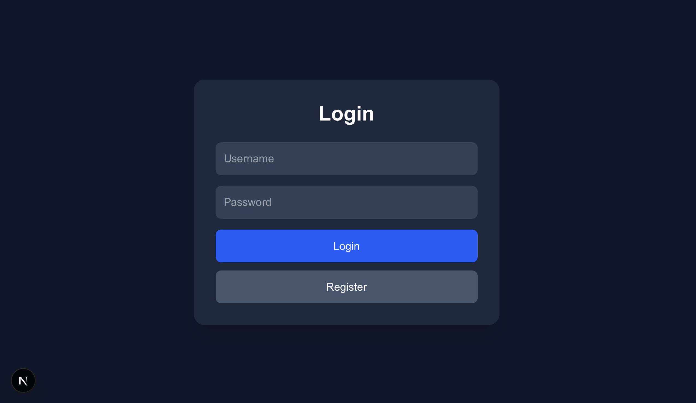
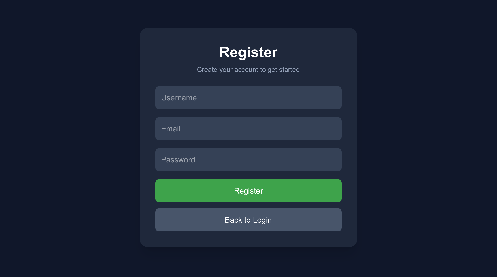
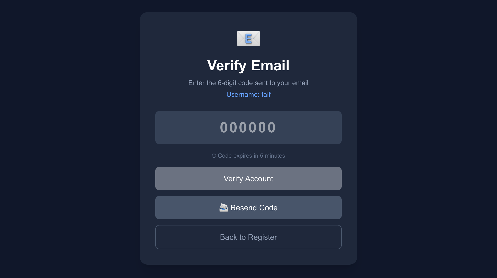
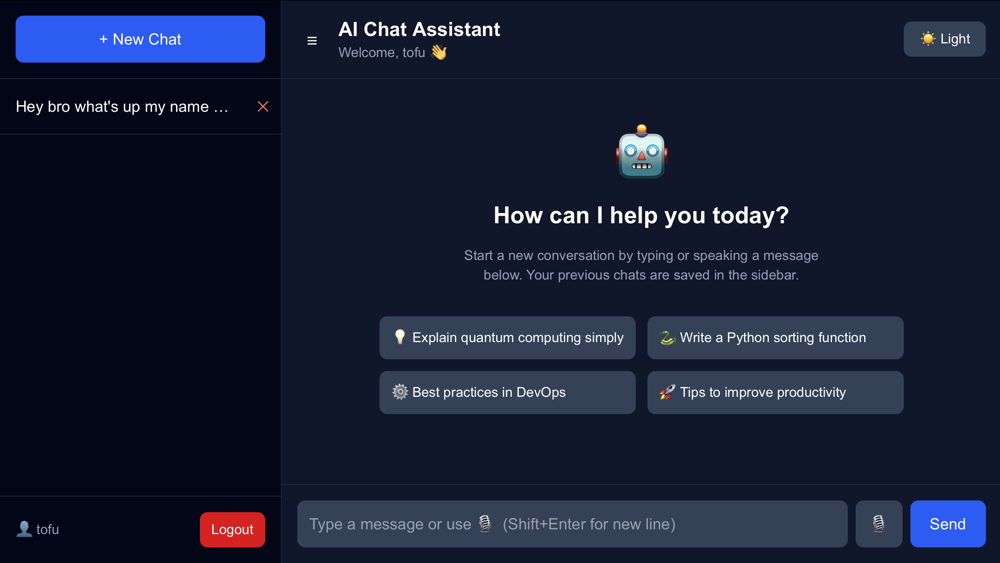
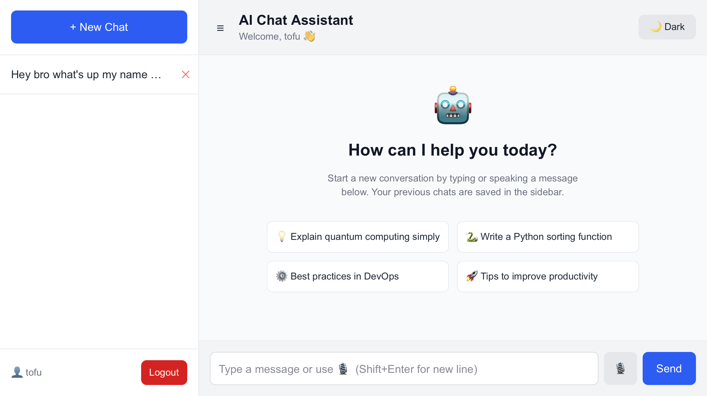
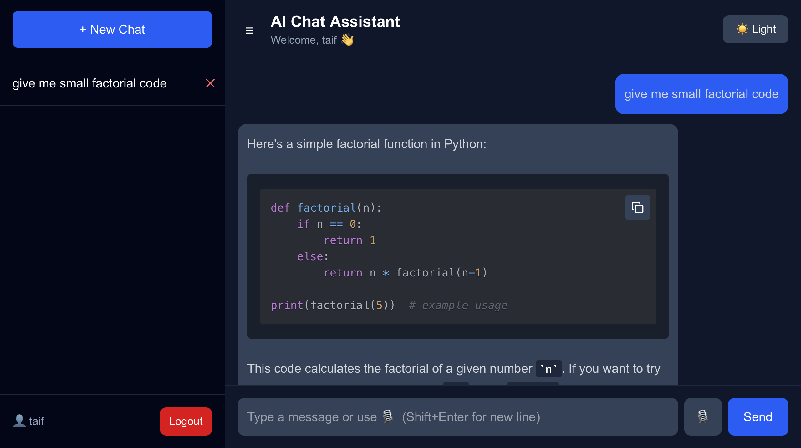

# AI Assistant Platform

> Production-ready AI chat application featuring JWT-based authentication, 
> email verification with OTP, per-user conversation isolation, real-time 
> typing animation, stop generation, voice input, dark/light theme, and 
> markdown + syntax highlighting — powered by Groq's Llama 3.3 70B Versatile 
> model via REST API.

---

# Features

- User Authentication (Register/Login)
- Email Verification (6-digit OTP, 5 min expiry)
- Resend Verification Code
- JWT Protected Routes
- Multi Chat Conversations
- Sidebar Chat History with Titles
- Delete Conversations
- Markdown Rendering
- Code Syntax Highlighting
- Copy Code Button
- Smooth AI Typing Animation
- Stop AI Response Button
- Voice Input (Groq Whisper API + Web Speech API)
- Dark/Light Theme Toggle
- Welcome Screen with Suggestions
- Username Display in Header
- Token Expiry Auto-Redirect
- Responsive UI

---

# Screenshots

### Login


### Register


### Email Verification


### Welcome Screen (Dark Mode)


### Welcome Screen (Light Mode)


### Code Conversation


---

# Project Structure

```bash
ai-assistant-platform/
│
├── backend/
│   ├── main.py
│   ├── models.py
│   ├── database.py
│   ├── requirements.txt
│   ├── chat_logs.txt
│   ├── conversations.json
│   └── .env                  ← create this manually
│
├── frontend/
│   ├── src/
│   ├── public/
│   ├── next.config.ts
│   ├── package.json
│   ├── tsconfig.json
│   ├── postcss.config.mjs
│   └── .env.local            ← create this manually
│
├── screenshots/
│   ├── login.png
│   ├── register.png
│   ├── verifcation_page.png
│   ├── welcome_page_black.png
│   ├── welcome_page_white.png
│   └── code_conversation.png
│
├── LICENSE
└── README.md
```

---

# Backend Setup

## 1. Navigate to backend

```bash
cd backend
```

## 2. Create virtual environment

### Mac/Linux

```bash
python3 -m venv venv
source venv/bin/activate
```

### Windows

```bash
python -m venv venv
venv\Scripts\activate
```

## 3. Install dependencies

```bash
pip install -r requirements.txt
```

If bcrypt error occurs:

```bash
pip install 'passlib[bcrypt]'
```

If SSL error occurs on Mac:

```bash
/Applications/Python\ 3.10/Install\ Certificates.command
```

## 4. Create .env file

Create a `.env` file inside the backend folder:

```env
GROQ_API_KEY=your_groq_api_key_here
MAIL_USERNAME=your_gmail@gmail.com
MAIL_PASSWORD=your_gmail_app_password
MAIL_FROM=your_gmail@gmail.com
SECRET_KEY=your_secret_key_here
```

### How to get Gmail App Password
1. Enable 2-Step Verification on your Google account
2. Go to `https://myaccount.google.com/apppasswords`
3. Generate a new app password for "Mail"
4. Copy the 16-character password (without spaces) into `.env`

## 5. Start backend server

```bash
uvicorn main:app --host 0.0.0.0 --port 8000 --reload
```

Backend runs at:
```
http://localhost:8000
```

---

# Frontend Setup

## 1. Navigate to frontend

```bash
cd frontend
```

## 2. Install packages

```bash
npm install
```

Install extra dependencies:

```bash
npm install react-markdown
npm install react-syntax-highlighter
npm install lucide-react
npm install @tailwindcss/typography
npm install -D @types/react-syntax-highlighter
```

## 3. Create .env.local file

Create a `.env.local` file inside the frontend folder:

```env
NEXT_PUBLIC_API_URL=http://localhost:8000
```

## 4. Start frontend

```bash
npm run dev
```

Frontend runs at:
```
http://localhost:3000
```

---

# API Endpoints

## Authentication

### Register
```http
POST /register
```

### Verify Email
```http
POST /verify
```

### Resend Code
```http
POST /resend-code
```

### Login
```http
POST /login
```

## Conversations

### Get All Conversations
```http
GET /conversations
```

### Get Single Conversation
```http
GET /conversation/{id}
```

### Delete Conversation
```http
DELETE /conversation/{id}
```

## Chat

### Send Message
```http
POST /chat
```

### Stop Generation
```http
POST /stop/{request_id}
```

### Save Partial Message
```http
POST /save-partial
```

### Voice Transcription
```http
POST /transcribe
```

---

# Tech Stack

## Frontend
- Next.js 16
- React
- Tailwind CSS
- TypeScript

## Backend
- FastAPI
- SQLAlchemy
- JWT Authentication
- SQLite
- FastAPI Mail

## AI
- Groq API
- Llama 3.3 70B Versatile
- Whisper Large V3 Turbo (Voice)

---

# Common Errors

## Tailwind Typography Error
```bash
npm install @tailwindcss/typography
```

## bcrypt Error
```bash
pip install 'passlib[bcrypt]'
```

## SSL Certificate Error (Mac)
```bash
/Applications/Python\ 3.10/Install\ Certificates.command
```

## Email not sending
- Make sure 2-Step Verification is enabled on Gmail
- Use App Password, not your regular Gmail password
- Remove spaces from the app password in `.env`

## Database column error
```bash
rm backend/ai_assistant.db
```
Restart backend — it will recreate automatically.

---

# Git Commands

## Commit Changes
```bash
git add .
git commit -m "your message"
git push origin main
```

## Pull Latest Changes
```bash
git pull origin main
```

---

# Contributors

## Mohammed Taif — Backend Developer
- FastAPI server & REST API design
- JWT Authentication (Register/Login)
- Email Verification System (OTP)
- Database models & SQLAlchemy ORM
- Groq AI integration (Llama 3.3 70B)
- Conversation & message management
- Stop generation & partial save logic
- Voice transcription (Groq Whisper)

## Fazil Khan — Frontend Developer
- Next.js app structure & routing
- Tailwind CSS UI design
- JWT auth flow (login/register/verify pages)
- Chat interface & sidebar
- Markdown & syntax highlighting rendering
- Smooth AI typing animation & stop button
- Voice input (Web Speech API + Whisper)
- Dark/Light theme toggle
- Welcome screen with suggestions

---

# Future Improvements

- Streaming Responses
- File Uploads
- Image Generation
- AI Memory
- Deploy to Vercel + Render
- Switch to PostgreSQL

---

# License

MIT License